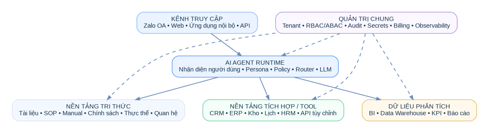
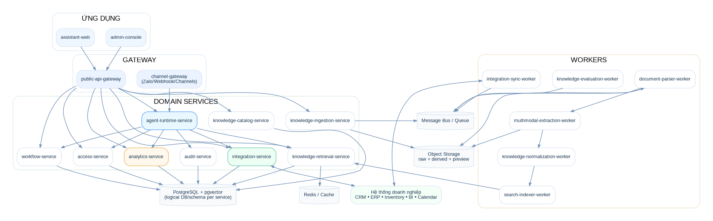
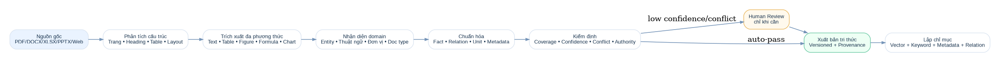
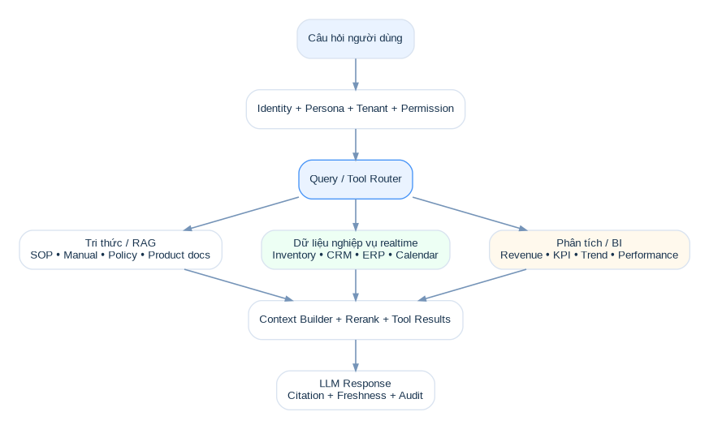
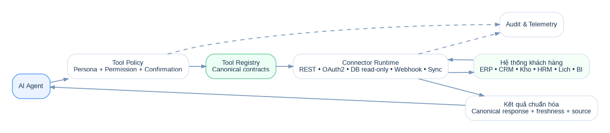

# KIẾN TRÚC HỆ THỐNG — D2K TECH ENTERPRISE AI ASSISTANT PLATFORM

> Phiên bản 3.0 — Microservices trong một monorepo. Thiết kế theo bounded context, configuration-driven, event-driven cho background processing và tách rõ Knowledge / Operational Tools / Analytics.

## 1. Kiến trúc tổng quan



Luồng ở mức cao:

```text
Channels → Agent Runtime → {Knowledge Retrieval | Tool Platform | Analytics}
                 ↓
      Identity + Persona + Policy
                 ↓
       Answer / Action + Audit
```

Các quyết định chính:
- Microservices nhưng không nano-services.
- Một monorepo để chia sẻ contract/tooling và giúp AI/Codex hiểu toàn hệ thống.
- Mỗi service có ownership dữ liệu và có thể deploy độc lập.
- Không service nào được đọc trực tiếp database của service khác như API nội bộ “tắt”.
- Worker xử lý tài liệu/tích hợp chạy bất đồng bộ qua queue/event bus.

## 2. Cấu trúc monorepo chuẩn

```text
d2k-enterprise-ai-platform/
├── apps/
│   ├── admin-console/
│   └── assistant-web/
│
├── gateways/
│   ├── public-api-gateway/
│   └── channel-gateway/
│
├── services/
│   ├── access-service/
│   ├── knowledge-catalog-service/
│   ├── knowledge-ingestion-service/
│   ├── knowledge-retrieval-service/
│   ├── agent-runtime-service/
│   ├── integration-service/
│   ├── analytics-service/
│   ├── workflow-service/
│   └── audit-service/
│
├── workers/
│   ├── document-parser-worker/
│   ├── multimodal-extraction-worker/
│   ├── knowledge-normalization-worker/
│   ├── search-indexer-worker/
│   ├── knowledge-evaluation-worker/
│   └── integration-sync-worker/
│
├── packages/
│   ├── contracts/
│   ├── authz/
│   ├── observability/
│   ├── llm/
│   ├── connectors-sdk/
│   ├── domain-schema/
│   ├── ui/
│   └── testkit/
│
├── infra/
│   ├── docker/
│   ├── helm/
│   ├── terraform/
│   └── local/
│
├── docs/
├── skills/
├── scripts/
├── AGENTS.md
└── README.md
```

### 2.1 Quy tắc đặt tên

- `apps/*`: UI có thể deploy.
- `gateways/*`: edge/provider adapters; không chứa business logic sâu.
- `services/*`: bounded context có API/event contract riêng.
- `workers/*`: background compute, scale theo queue.
- `packages/*`: library thuần, không sở hữu runtime/database.

## 3. Sơ đồ microservices



## 4. Trách nhiệm từng service

| Thành phần | Trách nhiệm | Không được làm |
|---|---|---|
| `public-api-gateway` | auth edge, request routing, rate limit, BFF aggregation nhẹ | business rules, truy DB domain |
| `channel-gateway` | Zalo/webhook/channel normalization | RAG, tool planning |
| `access-service` | tenant, user, role, persona assignment, policy/resource scope | knowledge parsing |
| `knowledge-catalog-service` | collection, schema, domain pack, document metadata/version, authority | parse file nặng |
| `knowledge-ingestion-service` | upload orchestration, ingestion job, status | tự làm toàn bộ OCR/vision |
| `knowledge-retrieval-service` | hybrid search, filters, rerank, citation context | gọi ERP trực tiếp |
| `agent-runtime-service` | session, query routing, LLM orchestration, tool selection, answer composition | sở hữu connector-specific code |
| `integration-service` | tool registry, connector config/runtime, credentials, request/response mapping | business persona policy cuối cùng |
| `analytics-service` | canonical analytics query/KPI access, freshness | document RAG |
| `workflow-service` | state machine/action workflow/approval/idempotency | direct UI state |
| `audit-service` | append audit events/query | operational business data |

## 5. Ownership dữ liệu và storage

### 5.1 PostgreSQL

Có thể dùng một PostgreSQL cluster giai đoạn đầu nhưng **logical database/schema ownership tách theo service**. Mục tiêu là dễ tách physical DB sau này.

Ví dụ:
- `access_db`: tenant, user, role, policy assignment.
- `knowledge_catalog_db`: collection, schema, document/version, entity/relation metadata.
- `retrieval_db`: chunk/embedding metadata nếu dùng pgvector.
- `integration_db`: connector config, tool registry mapping, sync state.
- `agent_db`: conversation/session/tool call metadata.
- `workflow_db`: workflow definition/instance.
- `audit_db`: audit log hoặc sink riêng.

### 5.2 Object Storage

Bucket/prefix tách:
- `raw/` — file gốc immutable.
- `derived/page-images/`.
- `derived/figures/`.
- `derived/tables/`.
- `derived/formulas/`.
- `generated/` — file AI tạo.

Object key luôn có tenant/document/version.

### 5.3 Search/Vector

MVP: PostgreSQL + pgvector + full-text search. Khi scale hoặc cần BM25/advanced filtering lớn có thể đưa OpenSearch/Elasticsearch nhưng contract retrieval không đổi.

### 5.4 Redis

Dùng cho cache, ephemeral session, rate limit, distributed lock ngắn hạn; không là source of truth.

### 5.5 Queue/Event Bus

RabbitMQ/SQS/Kafka tùy môi trường. Contract phải độc lập broker.

Các event chính:
- `document.uploaded`
- `document.parsed`
- `document.multimodal_extracted`
- `knowledge.normalized`
- `knowledge.review_required`
- `knowledge.published`
- `search.reindex_requested`
- `connector.sync_requested`
- `connector.sync_completed`
- `tool.execution_completed`

## 6. Knowledge Migration Architecture



### 6.1 Source Plane

Lưu document/version/page nguyên gốc và hash. Không overwrite historical version.

### 6.2 Structural Extraction Plane

Parser phát hiện page, block, heading, paragraph, table boundaries, image/figure, formula candidate, reading order.

### 6.3 Multimodal Extraction Plane

Worker chuyên biệt xử lý:
- text và scan page;
- bảng có row/column semantics;
- figure/diagram với caption;
- formula với LaTeX/variable mapping;
- chart/curve với caution flag nếu không đủ tin cậy để digitize.

### 6.4 Domain-aware Normalization

Dựa vào Domain Pack + tenant schema để đề xuất entity, relation, fact, unit, document type, metadata. Không hard-code ngành trong code.

### 6.5 Trust/Quality Plane

Mỗi derived item có:
- source document/version/page/region;
- extractor/model version;
- confidence;
- authority;
- review status;
- effective date;
- conflict group nếu có.

### 6.6 Publish Gate

Rule engine quyết định auto-publish hay human review theo loại fact và risk. Numeric technical fact có thể yêu cầu threshold cao hơn classification thông thường.

## 7. Retrieval Architecture



### 7.1 Query understanding

Input tạo structured query context:
- tenant;
- actor/persona;
- requested action;
- entities;
- domain;
- temporal intent;
- required freshness;
- security scope.

### 7.2 Retrieval order

1. Enforce tenant + permission filter.
2. Resolve entity/collection/time/version.
3. Chọn structured fact vs hybrid document retrieval.
4. Keyword + vector + metadata + relation candidate retrieval.
5. Authority/version scoring.
6. Reranking.
7. Context packing + citation.

### 7.3 Không dùng RAG cho realtime fact

`stock`, `order status`, `appointment availability`, `current price` nếu có hệ thống nguồn phải route sang Tool/Operational Data thay vì retrieval document cũ.

## 8. Integration & Tool Platform



### 8.1 Canonical Tool Contract

Agent Runtime gọi tool chuẩn:

```ts
inventory.getStock({ sku, storeId })
crm.findCustomer({ phone })
calendar.getSlots({ resourceId, dateRange })
analytics.salesSummary({ scope, period })
```

Connector làm nhiệm vụ map tool sang vendor/customer API.

### 8.2 Connector modes

- **Realtime**: gọi API nguồn khi user hỏi.
- **Sync**: đồng bộ interval vào operational cache/store.
- **Webhook/Event**: nguồn push thay đổi vào platform.
- **Read-only DB template**: query template đã approve, bind parameter.
- **File/Batch**: CSV/XLSX/SFTP khi doanh nghiệp chưa có API.

### 8.3 Generic REST Connector

Admin cấu hình:
- base URL;
- auth strategy;
- endpoint/method;
- input mapping;
- response mapping;
- timeout/retry;
- freshness semantics;
- health check.

Output luôn normalize về canonical response.

### 8.4 Secrets

Credential reference lưu ở integration DB, secret thật nằm Secret Manager/Vault/KMS-backed store. Worker/service nhận secret theo runtime identity.

### 8.5 Tool policy

Agent không được thấy mọi tool. Tool list được derive từ tenant + persona + resource scope. Action có side effect có `requires_confirmation`/`requires_approval`.

## 9. Analytics Architecture

`analytics-service` là abstraction cho KPI/BI. Có thể adapter tới:
- Data Warehouse;
- BI API;
- approved SQL semantic layer;
- metrics store.

Đầu ra canonical:

```json
{
  "metric": "sales_revenue",
  "value": 1280000000,
  "currency": "VND",
  "period": {"from":"...","to":"..."},
  "scope": "store:CAUGIAY",
  "freshness": "2026-09-16T00:10:00+07:00",
  "source": "sales_dw"
}
```

AI có thể giải thích nhưng phải phân biệt correlation/suy luận với causal fact.

## 10. Agent Runtime

### 10.1 Pipeline

```text
message
→ identity/tenant resolution
→ persona + policy
→ intent/query classification
→ plan: knowledge | tool | analytics | mixed | workflow
→ execute approved retrieval/tools
→ validate result/freshness
→ compose grounded answer
→ audit + telemetry
```

### 10.2 Model Gateway

`packages/llm` hoặc service adapter chuẩn hóa model provider, token/cost, timeout, structured output, retry. Model routing được cấu hình theo task/tenant/plan.

### 10.3 Guardrails

- structured tool calling;
- JSON schema validation;
- prompt injection isolation giữa untrusted document content và system/tool instructions;
- no secret in context;
- max tool iterations;
- restricted side effect;
- citation/freshness requirement theo policy.

## 11. Workflow Service

Workflow definition dạng versioned state machine. Ví dụ booking:

```text
collect desired time
→ calendar.getSlots
→ present choices
→ user confirmation
→ calendar.createBooking
→ audit
→ notification
```

Action phải idempotent qua idempotency key/correlation id.

## 12. Channel Gateway

Provider-specific code nằm ở đây:
- normalize inbound message;
- verify webhook/signature;
- attachment/media ingestion;
- outbound message adaptation;
- provider retry/rate policy.

Agent Runtime chỉ nhận canonical channel message, không biết Zalo-specific payload.

## 13. Security Architecture

### 13.1 Zero cross-tenant

Mọi API/event/tool call chứa `tenant_id` từ trusted auth context, không tin tenant id user gửi tùy ý.

### 13.2 Authorization

Policy decision input:

```text
actor + persona + action + resource + tenant + channel + context
```

Enforcement tại API/service và lặp lại trước retrieval/tool execution cho defense in depth.

### 13.3 Data classification

Knowledge/resource có classification và allowed roles/scopes. Retrieval filter trước context building.

### 13.4 Audit

Bắt buộc với login/admin change/knowledge publish/tool side-effect/permission change/connector config.

## 14. Observability

Chuẩn chung package `observability`:
- OpenTelemetry trace;
- structured log;
- metrics;
- correlation id;
- tenant id đã sanitize;
- model/tool/retrieval span.

Dashboard kỹ thuật theo dõi:
- API p95/p99;
- model latency/cost;
- retrieval zero-hit;
- queue lag;
- parser failure;
- connector success/freshness;
- tool authorization denied;
- human review backlog.

## 15. Deployment

### 15.1 Local

Docker Compose cho Postgres, Redis, Object Storage, queue, service subset.

### 15.2 Production

Kubernetes phù hợp khi cần scale độc lập. Mỗi service có:
- Dockerfile riêng;
- health/readiness endpoint;
- Helm chart hoặc shared chart + values;
- HPA theo CPU/request/queue;
- service account/least privilege.

Monorepo CI chỉ build/test/deploy affected services.

## 16. API và Event Contract

Contract đặt trong `packages/contracts`, versioned và backward-compatible. Không import internal service model xuyên boundary.

REST conventions:
- `/v1/...`;
- request id/correlation id;
- standard error envelope;
- pagination/filtering;
- idempotency key cho command.

Event conventions:
- event name + schema version;
- tenant id;
- aggregate id;
- occurred_at;
- trace/correlation id;
- payload tối thiểu, tránh đưa secret/large content lên event bus.

## 17. Failure handling

- External connector: timeout + circuit breaker + bounded retry.
- Async jobs: retry + DLQ + retry UI.
- Parser partial failure: page-level status, không báo document success giả nếu mất trang.
- LLM failure: fallback model hoặc graceful error, không execute action hai lần.
- Search/index failure: publish state và index state tách để reindex.

## 18. Cost control

Track theo tenant:
- model/token/cost;
- embedding;
- storage;
- connector calls;
- document pages/extraction;
- tool executions.

Dùng cache và small-model routing cho classification/simple Q&A khi phù hợp.

## 19. Architecture Decision Rules cho AI/Codex

1. Không thêm service mới nếu responsibility vẫn thuộc bounded context hiện tại.
2. Không cho gateway chứa domain business logic.
3. Không đọc DB của service khác.
4. Không hard-code domain-specific entity/field trong core.
5. Không gửi raw external API schema vào Agent Runtime; normalize qua Tool Contract.
6. Không publish derived technical fact mà thiếu provenance.
7. Không bypass permission vì “AI đã biết user là manager”.
8. Mọi side-effect tool phải audit và idempotent khi thích hợp.
9. Mọi thay đổi retrieval/migration phải chạy evaluation regression.
10. UI text người dùng mặc định tiếng Việt.

## 20. Lộ trình tách hạ tầng khi scale

MVP có thể dùng shared Postgres/Redis/queue cluster. Khi tải tăng:
- tách retrieval DB/vector;
- tách audit sink;
- tách analytics warehouse adapter;
- scale parser/multimodal workers riêng;
- tách connector worker theo high-volume tenant;
- chuyển full-text/vector sang dedicated search engine nếu benchmark chứng minh cần.

Điều quan trọng là **contract/service ownership đã tách từ đầu**, nên physical infrastructure có thể tiến hóa mà không đổi product model.
